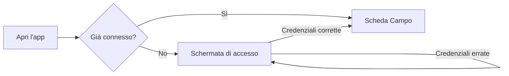
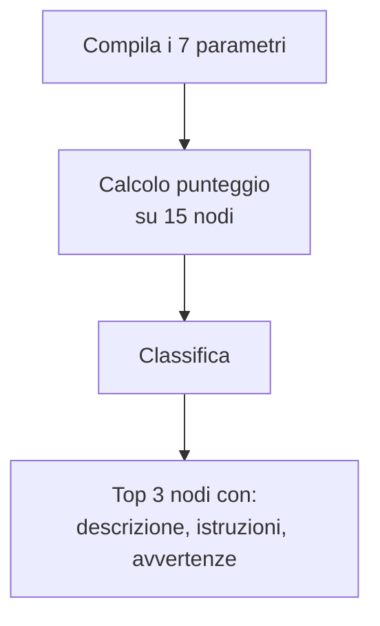
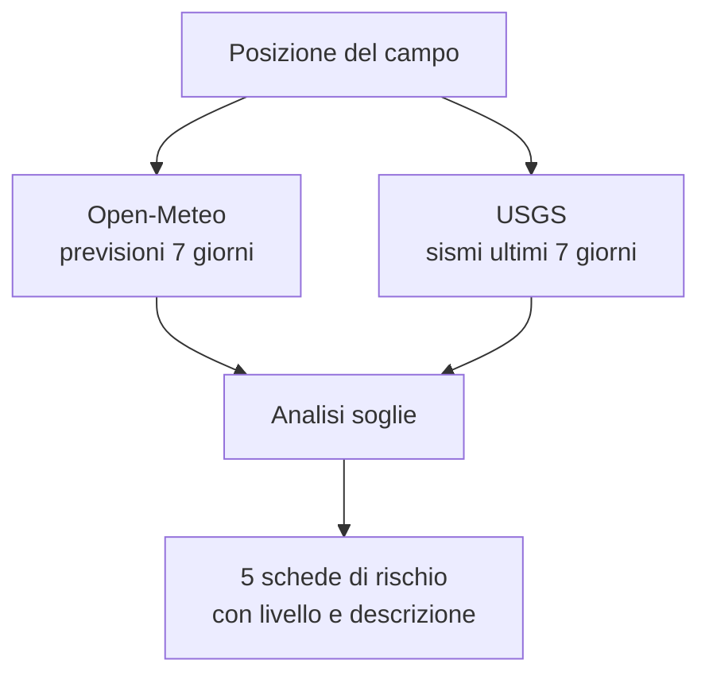

# ScoutSafe — Manuale Utente

**La sicurezza del tuo campo scout, in una sola app.**

ScoutSafe ti accompagna in tutte le fasi dell'allestimento di un campo: dalla scelta del luogo, alla selezione dei nodi giusti, fino alla valutazione dei rischi ambientali basata su dati meteo e sismici reali. Al termine puoi generare un rapporto di sicurezza completo e conservarlo nello storico.

L'app funziona da browser, su computer, tablet e smartphone, all'indirizzo:

**https://marctie.github.io/ScoutSafe/**

---

## Indice

1. [Primi passi: l'accesso](#1-primi-passi-laccesso)
2. [Installare ScoutSafe sul tuo dispositivo](#2-installare-scoutsafe-sul-tuo-dispositivo)
3. [La struttura dell'app](#3-la-struttura-dellapp)
4. [Scheda "Campo": configurare il campo](#4-scheda-campo-configurare-il-campo)
5. [Scheda "Nodi": il consigliere di nodi](#5-scheda-nodi-il-consigliere-di-nodi)
6. [Scheda "Rischi": la valutazione ambientale](#6-scheda-rischi-la-valutazione-ambientale)
7. [Scheda "Rapporto": il rapporto di sicurezza](#7-scheda-rapporto-il-rapporto-di-sicurezza)
8. [Scheda "Storico": le sessioni salvate](#8-scheda-storico-le-sessioni-salvate)
9. [Scheda "Profilo": l'area personale](#9-scheda-profilo-larea-personale)
10. [Modalità offline](#10-modalità-offline)
11. [Affidabilità delle funzioni](#11-affidabilità-delle-funzioni)
12. [Domande frequenti](#12-domande-frequenti)
13. [Avvertenze importanti](#13-avvertenze-importanti)
14. [Per sviluppatori: build Android e iOS](#14-per-sviluppatori-build-android-e-ios)

---

## 1. Primi passi: l'accesso

All'apertura dell'app compare la schermata di accesso. Inserisci l'email e la password che ti sono state fornite e premi **Accedi**.

- L'accesso viene ricordato sul dispositivo: alla prossima apertura entrerai direttamente, senza reinserire le credenziali.
- Per uscire, usa il pulsante **Esci** nella scheda **Profilo**.

Se compare "Password errata", controlla maiuscole/minuscole e caratteri speciali: la password li distingue.



---

## 2. Installare ScoutSafe sul tuo dispositivo

ScoutSafe è prima di tutto un'app web: funziona subito da browser, senza installazione, all'indirizzo indicato in cima a questo manuale. Ma puoi anche "installarla" per averla come una app vera e propria, con icona sulla schermata home e funzionamento offline parziale. Ci sono tre modi, in ordine di semplicità.

### 2.1 Come PWA (consigliato, funziona su Android, iPhone/iPad e computer)

ScoutSafe è una **Progressive Web App**: si installa direttamente dal browser, senza store, in pochi secondi.

**Su Android (Chrome):**
1. Apri l'app dal link nel browser.
2. Tocca il menu (⋮) in alto a destra.
3. Seleziona **"Installa app"** o **"Aggiungi a schermata Home"**.
4. Conferma: l'icona di ScoutSafe comparirà tra le tue app.

**Su iPhone/iPad (Safari):**
1. Apri l'app dal link in Safari (l'installazione PWA su iOS funziona solo da Safari, non da Chrome).
2. Tocca l'icona di condivisione (il quadrato con la freccia verso l'alto).
3. Scorri e seleziona **"Aggiungi alla schermata Home"**.
4. Conferma il nome e tocca **"Aggiungi"**.

**Su computer (Chrome, Edge):**
1. Apri l'app nel browser.
2. Cerca l'icona di installazione nella barra degli indirizzi (di solito un'iconcina con un "+" o un monitor), oppure apri il menu del browser.
3. Seleziona **"Installa ScoutSafe"**.

Una volta installata, l'app si apre a schermo intero, ha una sua icona dedicata e conserva in cache le pagine già visitate per l'uso offline (vedi [capitolo 10](#10-modalità-offline)).

### 2.2 Come app Android nativa (file APK)

Se preferisci un vero file installabile (`.apk`) invece della PWA, puoi generarlo tu stesso a partire dal codice sorgente. Questo richiede un minimo di dimestichezza tecnica: la guida completa passo-passo è nel [capitolo 14](#14-per-sviluppatori-build-android-e-ios).

In sintesi: il progetto include già la piattaforma Android (cartella `android/`), pronta per essere aperta in **Android Studio** e compilata in un APK da installare su qualunque telefono Android, oppure da pubblicare sul Play Store.

### 2.3 Come app iOS nativa

Apple richiede obbligatoriamente un **computer Mac con Xcode** per compilare, firmare e installare un'app iOS nativa: non è possibile farlo da Windows o Linux, nemmeno con Capacitor. Se non hai un Mac, la strada più semplice e già disponibile oggi è **installare ScoutSafe come PWA da Safari** (sezione 2.1): copre la stragrande maggioranza delle funzionalità, incluse icona sulla home e uso offline.

Se in futuro avrai accesso a un Mac, la guida completa per generare e installare la versione iOS nativa è nel [capitolo 14](#14-per-sviluppatori-build-android-e-ios).

---

## 3. La struttura dell'app

In basso trovi sei schede, pensate per essere usate in sequenza durante l'allestimento del campo:

| Scheda | Icona | A cosa serve |
|---|---|---|
| **Campo** | 🗺️ | Dai un nome al campo e fissane la posizione (GPS o manuale) |
| **Nodi** | 🪢 | Ricevi i 3 nodi più adatti alla tua situazione |
| **Rischi** | ⚠️ | Valutazione dei rischi ambientali sulla posizione del campo |
| **Rapporto** | 📄 | Riepilogo completo, con note, da salvare o stampare |
| **Storico** | 🕒 | Tutte le sessioni salvate in passato |
| **Profilo** | 👤 | Area personale: statistiche, gestione dati, uscita |

Il flusso di lavoro tipico:


---

## 4. Scheda "Campo": configurare il campo

È il punto di partenza di ogni sessione.

**Cosa fare, in ordine:**

1. **Nome del campo** — scrivi un nome riconoscibile (es. "Campo estivo Val Codera 2026").
2. **Posizione** — hai due possibilità:
   - **Usa GPS**: premi il pulsante e concedi al browser il permesso di geolocalizzazione. Le coordinate vengono rilevate automaticamente.
   - **Inserimento manuale**: digita latitudine e longitudine (le trovi ad esempio in Google Maps con un clic destro sul punto).
3. **Verifica sulla mappa** — la mappa (OpenStreetMap) mostra un segnaposto sulla posizione scelta: controlla che sia davvero il punto del tuo campo.

> 💡 **Consiglio**: se sei già sul posto, il GPS è la via più rapida e precisa. Se stai pianificando da casa, usa l'inserimento manuale con le coordinate del luogo previsto.

La posizione impostata qui viene usata dalla scheda **Rischi** per interrogare i servizi meteo e sismici: senza posizione, l'analisi dei rischi non può partire.

---

## 5. Scheda "Nodi": il consigliere di nodi

Rispondi a poche domande e ricevi i **3 nodi più adatti** alla tua situazione, ordinati per punteggio di idoneità, con descrizione, istruzioni passo-passo e avvertenze.

**I parametri richiesti:**

| Parametro | Opzioni | Perché conta |
|---|---|---|
| Scopo d'uso | ancoraggio, giunzione, asola, avvolgimento, legatura, arrampicata | Ogni nodo nasce per un compito preciso |
| Condizione corda | asciutta, bagnata | Alcuni nodi scivolano o si bloccano da bagnati |
| Tipo di corda | naturale, sintetica, mista | La tenuta cambia con il materiale |
| Tipo di carico | statico, dinamico, pesante | Un nodo per carichi statici può cedere sotto strappi |
| Esperienza | principiante, intermedio, esperto | Nodi complessi mal eseguiti sono pericolosi |
| Impiego | tenda, alzabandiera, ponte, attrezzi, soccorso, generico | Contestualizza la raccomandazione |
| Vento | assente, leggero, medio, forte | Col vento forte servono nodi che non si allentano |

**Come funziona:** l'app confronta le tue risposte con una banca dati di **15 nodi scout classici** (Gassa d'Amante, Nodo Piano, Barcaiolo, Savoia, Prussik, Scotta e altri), ciascuno descritto con i suoi punti di forza e i suoi limiti. Un algoritmo a punteggio premia i nodi adatti al tuo scenario e penalizza quelli controindicati (ad esempio il Nodo Piano su corda bagnata). Il risultato è sempre coerente e ripetibile: a parità di risposte, stessi consigli.



> ⚠️ Leggi sempre le **avvertenze** riportate sotto ogni nodo: segnalano i casi in cui quel nodo NON va usato.

---

## 6. Scheda "Rischi": la valutazione ambientale

Il cuore di ScoutSafe: un'analisi dei rischi del luogo del campo basata su **dati reali e aggiornati**, non su stime generiche.

**Prerequisito:** aver impostato la posizione nella scheda **Campo**.

**Le cinque valutazioni:**

| Rischio | Fonte dati | Soglie |
|---|---|---|
| 🌊 **Alluvione** | Previsioni di precipitazione a 7 giorni (Open-Meteo) | Basso < 5 mm/giorno · Medio 5–20 · Alto > 20 |
| 💨 **Vento** | Raffiche massime previste a 7 giorni (Open-Meteo) | Basso < 30 km/h · Medio 30–60 · Alto > 60 |
| 🌡️ **Temperatura** | Previsioni orarie (Open-Meteo) | Sicuro > 10 °C · Attenzione 0–10 · Pericolo < 0 |
| ❄️ **Neve/Ghiaccio** | Nevicate previste (Open-Meteo) | Sicuro 0 mm · Attenzione 1–10 · Pericolo > 10 |
| 🌍 **Sismico** | Terremoti reali degli ultimi 7 giorni entro 100 km (USGS) | Da "nessuno" ad "alto" in base a numero e magnitudo |

Ogni rischio è mostrato come una scheda colorata con il livello (**nessuno / basso / medio / ALTO**), il valore misurato e una descrizione di cosa significa in pratica per il campo.



> 💡 **Consiglio**: rilancia l'analisi ogni giorno durante il campo. Le previsioni meteo cambiano, e l'analisi fotografa la situazione al momento in cui la esegui.

---

## 7. Scheda "Rapporto": il rapporto di sicurezza

Raccoglie in un unico documento tutto il lavoro fatto:

- i dati del campo (nome, coordinate);
- i nodi consigliati con i parametri usati per ottenerli;
- la valutazione completa dei cinque rischi;
- le tue **note libere** (es. "torrente a 200 m, prevedere piano di evacuazione").

**Per salvare:** aggiungi le eventuali note e premi **Salva**. La sessione finisce nello **Storico** e nelle statistiche del **Profilo**.

**Per esportare in PDF:** premi **Esporta PDF**. Viene generato e scaricato subito un file PDF con il nome del campo, la posizione, i nodi consigliati, la valutazione dei rischi e le tue note: pronto da condividere via email, WhatsApp o da stampare, anche senza passare dalla funzione di stampa del browser.

Il rapporto è pensato anche per essere mostrato o stampato (dalla funzione di stampa del browser) come documento di riferimento per i capi campo.

> Il pulsante Salva è attivo solo se hai almeno configurato il campo e ottenuto nodi o rischi: un rapporto vuoto non è salvabile. Il pulsante Esporta PDF invece funziona anche senza salvare prima, e può essere usato più volte.

---

## 8. Scheda "Storico": le sessioni salvate

Qui trovi tutte le sessioni salvate, ordinate dalla più recente.

- **Tocca una sessione** per espanderla e rivedere tutti i dettagli (campo, nodi, rischi, note).
- **Esporta PDF** dalla sessione espansa: rigenera in qualsiasi momento il rapporto PDF di una sessione passata, anche mesi dopo.
- **Elimina** una sessione con il pulsante dedicato (ti viene chiesta conferma).

**Dove sono i dati?** Le sessioni sono salvate **sul dispositivo che stai usando** (nella memoria del browser). Questo significa:

- funzionano anche senza connessione, una volta caricata l'app;
- non sono visibili da altri dispositivi: lo storico del telefono e quello del computer sono separati;
- se cancelli i dati di navigazione del browser, lo storico viene perso.

---

## 9. Scheda "Profilo": l'area personale

La tua area personale raccoglie account, statistiche e gestione dei dati.

**Cosa contiene:**

- **Il mio account** — l'email con cui sei connesso.
- **Le mie statistiche** —
  - numero totale di sessioni salvate;
  - numero di campi in cui è stato rilevato almeno un rischio **alto**;
  - data e nome dell'ultima sessione salvata.
- **Gestione dati**:
  - **Esporta backup (JSON)** — scarica un file `.json` con tutte le tue sessioni salvate. Usalo per fare una copia di sicurezza prima di cancellare i dati del browser, o per trasferire lo storico su un altro dispositivo.
  - **Importa backup (JSON)** — carica un file esportato in precedenza: le sessioni contenute vengono aggiunte al tuo storico attuale (non sovrascrive quelle già presenti). Utile dopo aver cambiato dispositivo o reinstallato il browser.
  - **Svuota storico** — elimina in un colpo solo tutte le sessioni salvate su questo dispositivo (con richiesta di conferma; l'operazione non è reversibile — se non sei sicuro, esporta prima un backup).
- **Informazioni** — versione dell'app e collegamento al progetto.
- **Esci** — chiude la sessione e torna alla schermata di accesso.

> 💡 **Consiglio**: il file di backup contiene solo i dati del campo, dei nodi e dei rischi che hai salvato — nessun dato personale sensibile. Puoi conservarlo tranquillamente su un cloud (Google Drive, email a te stesso, ecc.).

---

## 10. Modalità offline

Da quando ScoutSafe è installabile come PWA (vedi [capitolo 2](#2-installare-scoutsafe-sul-tuo-dispositivo)), l'app salva automaticamente in cache le pagine, gli stili e gli script già visitati. Questo significa che:

- **Dopo il primo caricamento**, puoi riaprire ScoutSafe anche senza connessione: l'app si avvia comunque e puoi consultare nodi già visualizzati e lo storico salvato.
- **La mappa** mostra le tessere (i riquadri della cartina) già caricate in precedenza nella stessa zona; zone mai visitate prima richiedono connessione per scaricare le tessere.
- **I dati di rischio** (meteo e sismici) vengono sempre richiesti aggiornati quando c'è connessione. Se per un breve periodo la connessione cade, l'app può mostrare l'ultimo dato ottenuto (fino a poche ore prima) invece di un errore; quando la connessione torna, i dati si aggiornano di nuovo in automatico alla prossima apertura della scheda Rischi.
- **Lo storico e le sessioni salvate** funzionano sempre offline: sono salvati sul dispositivo, non dipendono da internet.

**Cosa NON funziona offline:** il primo accesso in assoluto (serve scaricare l'app almeno una volta), l'analisi rischi su una posizione mai interrogata prima, e il caricamento di zone di mappa mai visualizzate.

> 💡 Per un campo in zona senza copertura di rete, apri ScoutSafe e naviga tutte le schede **mentre sei ancora connesso** (es. da casa o in auto), così l'app avrà già in cache mappa, nodi e un'analisi rischi recente prima di partire.

---

## 11. Affidabilità delle funzioni

Percentuali di affidabilità stimate per ogni funzione, con la motivazione. Le stime tengono conto della natura dei dati (deterministici o previsionali) e della qualità delle fonti.

| Funzione | Affidabilità stimata | Motivazione |
|---|---|---|
| **Accesso e sessione** | ~99% | Meccanismo semplice e deterministico; l'unico punto di attenzione è la digitazione corretta delle credenziali |
| **Consigliere di nodi** | ~95% | Algoritmo deterministico su una banca dati curata di 15 nodi: a parità di input dà sempre lo stesso risultato. Il margine residuo riflette situazioni sul campo non catturabili da 7 parametri |
| **Rilevazione GPS** | ~90% | Dipende dal dispositivo e dall'ambiente: all'aperto la precisione è di pochi metri, al chiuso o in valli strette può degradare |
| **Mappa** | ~98% | Visualizzazione OpenStreetMap consolidata; richiede connessione per caricare le tessere della mappa |
| **Rischio sismico** | ~90% | Basato su terremoti **realmente avvenuti** (catalogo USGS, riferimento mondiale). Il limite: la sismicità passata non predice con certezza quella futura |
| **Rischio vento** | ~80–85% | Previsioni Open-Meteo a 7 giorni: molto buone nei primi 2–3 giorni (~90%), meno affidabili verso il settimo (~70%) |
| **Rischio alluvione** | ~75–80% | Basato sulle precipitazioni previste: buona approssimazione, ma il rischio reale dipende anche da fattori locali (pendenza, drenaggio, vicinanza a corsi d'acqua) che l'app non vede |
| **Rischio temperatura** | ~85–90% | Le previsioni di temperatura sono tra le più accurate; possibile scarto nei microclimi di montagna |
| **Rischio neve** | ~80% | Come per la pioggia: buone previsioni generali, variabilità locale in quota |
| **Salvataggio storico** | ~95% | Salvataggio locale immediato e affidabile; il rischio residuo è la cancellazione dei dati del browser |
| **Rapporto** | ~98% | Pura aggregazione di dati già validati nelle altre schede |

**Come leggere queste percentuali:** i valori vicini al 100% indicano funzioni deterministiche, che falliscono solo per cause esterne (connessione, permessi). I valori tra 75% e 90% riguardano funzioni **previsionali**: sono lo strumento giusto per decidere, ma vanno integrati con l'osservazione diretta e il buon senso.

---

## 12. Domande frequenti

**Posso usare l'app senza connessione?**
In parte. Una volta caricata, la navigazione tra le schede, i nodi e lo storico funzionano offline. L'analisi dei rischi e il caricamento della mappa richiedono connessione.

**Perché lo storico è vuoto su un altro dispositivo?**
I dati sono salvati localmente su ciascun dispositivo, non su un server. Ogni dispositivo ha il proprio storico.

**Le previsioni sono aggiornate?**
Sì: ogni volta che apri la scheda Rischi, l'app interroga i servizi in tempo reale. La data/ora dell'analisi è indicata nella schermata.

**Il GPS non funziona.**
Controlla di aver concesso il permesso di geolocalizzazione al browser (icona del lucchetto nella barra degli indirizzi → Autorizzazioni). In alternativa inserisci le coordinate a mano.

**Posso stampare il rapporto?**
Sì, dalla scheda Rapporto usa la stampa del browser (`Ctrl+P` su computer, menu Condividi → Stampa su smartphone).

**Ho dimenticato la password.**
Le credenziali sono gestite dall'amministratore del progetto: contattalo per il recupero.

**Posso avere una copia di sicurezza delle mie sessioni?**
Sì: vai in **Profilo → Esporta backup (JSON)** per scaricare tutte le sessioni in un file. Con **Importa backup (JSON)** puoi ricaricarle in qualsiasi momento, anche su un altro dispositivo o dopo aver reinstallato il browser.

**L'app funziona se non ho linea/rete durante il campo?**
In parte: se hai già aperto ScoutSafe almeno una volta con connessione, l'app si installa in cache e resta utilizzabile (storico, nodi, mappa delle zone già viste). Vedi il [capitolo 10](#10-modalità-offline) per i dettagli.

---

## 13. Avvertenze importanti

> ⚠️ **ScoutSafe è uno strumento di supporto alle decisioni, non le sostituisce.**
>
> - Le valutazioni di rischio si basano su previsioni e dati storici: verifica sempre le condizioni reali sul posto e i bollettini ufficiali (Protezione Civile, ARPA regionali).
> - I nodi consigliati vanno eseguiti correttamente: in caso di dubbio, fatti seguire da un capo esperto. Un nodo giusto ma mal eseguito è un nodo sbagliato.
> - Per attività critiche (ponti, teleferiche, soccorso) la supervisione di personale qualificato è sempre necessaria.
> - La responsabilità finale della sicurezza del campo resta di chi lo conduce.

Buon campo! ⛺

---

## 14. Per sviluppatori: build Android e iOS

Questo capitolo è tecnico: si rivolge a chi vuole compilare l'app come applicazione nativa invece di usarla via browser/PWA. Il progetto usa **Capacitor**, che avvolge l'app web in un contenitore nativo per Android e iOS.

### 14.1 Build Android

**Requisiti:**
- [Node.js](https://nodejs.org/) 20 o superiore
- [Android Studio](https://developer.android.com/studio) (include l'Android SDK)
- Un JDK compatibile con Gradle. Android Studio include già un JDK adatto (percorso tipico su Windows: `C:\Program Files\Android\Android Studio\jbr`); se sul computer è installato anche un JDK molto recente (es. Java 24/25) come JDK "di sistema", **Gradle potrebbe non avviarsi** con quello — in tal caso usa esplicitamente il JDK incluso in Android Studio (vedi sotto).

**Passi:**

1. Clona il repository e installa le dipendenze:
   ```bash
   git clone https://github.com/Marctie/ScoutSafe.git
   cd ScoutSafe
   npm install
   ```

2. Compila il progetto web e allinea la piattaforma Android (già presente nella cartella `android/`):
   ```bash
   npm run build
   npx cap sync android
   ```

3. **Opzione A — Android Studio (consigliata):**
   - Apri la cartella `android/` come progetto in Android Studio.
   - Attendi la sincronizzazione Gradle (automatica al primo avvio).
   - Collega un telefono Android via USB con il **debug USB attivo**, oppure avvia un emulatore.
   - Premi il pulsante ▶ **Run** per installare ed avviare l'app sul dispositivo/emulatore.
   - Per generare un APK installabile manualmente: menu **Build → Build Bundle(s) / APK(s) → Build APK(s)**. Il file compare in `android/app/build/outputs/apk/debug/app-debug.apk`.

   **Opzione B — riga di comando:**
   ```bash
   cd android
   ./gradlew assembleDebug
   ```
   Se ottieni l'errore `Unsupported class file major version`, il JDK di sistema è troppo recente per Gradle: imposta temporaneamente `JAVA_HOME` sul JDK incluso in Android Studio prima di lanciare il comando, ad esempio su Windows (PowerShell):
   ```powershell
   $env:JAVA_HOME = "C:\Program Files\Android\Android Studio\jbr"
   $env:ANDROID_HOME = "$env:LOCALAPPDATA\Android\Sdk"
   ./gradlew assembleDebug
   ```
   L'APK compilato si trova in `android/app/build/outputs/apk/debug/app-debug.apk`.

4. **Installare l'APK su un telefono Android:**
   - Copia il file `app-debug.apk` sul telefono (via cavo USB, email, cloud, ecc.).
   - Sul telefono, apri il file: se richiesto, consenti l'installazione da "origini sconosciute" per l'app usata per aprirlo (impostazione richiesta una tantum da Android per motivi di sicurezza).
   - Conferma l'installazione. L'icona di ScoutSafe comparirà tra le app installate.
   - In alternativa, con il telefono collegato via USB e debug attivo, `npx cap run android` installa e avvia l'app direttamente dal computer.

   Un APK di **debug** è pensato per test personali; per distribuirlo pubblicamente (Play Store) serve generare una build **release firmata** — la guida ufficiale è su [capacitorjs.com/docs/android](https://capacitorjs.com/docs/android).

### 14.2 Build iOS

**Apple richiede obbligatoriamente un Mac con Xcode installato**: non esiste un modo per compilare, firmare o installare un'app iOS nativa da Windows o Linux, nemmeno con Capacitor (che si limita a generare un progetto Xcode — la compilazione vera e propria resta un passo che solo macOS può fare).

**Se hai un Mac disponibile:**

1. Installa [Xcode](https://apps.apple.com/app/xcode/id497799835) dal Mac App Store (gratuito).
2. Sul Mac, clona il repository e installa le dipendenze:
   ```bash
   git clone https://github.com/Marctie/ScoutSafe.git
   cd ScoutSafe
   npm install
   npm install @capacitor/ios
   ```
3. Compila il progetto web e aggiungi/allinea la piattaforma iOS:
   ```bash
   npm run build
   npx cap add ios
   npx cap sync ios
   ```
4. Apri il progetto in Xcode:
   ```bash
   npx cap open ios
   ```
5. In Xcode:
   - Seleziona il progetto nel pannello di sinistra → scheda **Signing & Capabilities**.
   - In **Team**, seleziona il tuo Apple ID personale (per test su un tuo dispositivo, un Apple ID gratuito basta) oppure un **Apple Developer Program** attivo (99 $/anno) se vuoi pubblicare su App Store o distribuire a più persone con TestFlight.
   - Collega l'iPhone/iPad via cavo, selezionalo come dispositivo di destinazione in alto, e premi ▶ **Run**.
   - Con un Apple ID gratuito, l'app installata scade dopo 7 giorni e va ricompilata; con un account Developer a pagamento dura fino a un anno o è distribuibile via TestFlight/App Store.

**Se non hai un Mac:** le alternative realistiche sono:
- Usare un Mac in prestito (anche solo per un pomeriggio, il processo sopra richiede poco tempo).
- Un servizio di "Mac in cloud" a noleggio (es. MacStadium, MacinCloud).
- Un servizio di build CI con runner macOS, come **Codemagic** o **Ionic Appflow**, che compilano il progetto Capacitor/iOS nel cloud e restituiscono un file installabile o un link TestFlight, senza bisogno di possedere un Mac.
- Nel frattempo, **installare ScoutSafe come PWA da Safari** (vedi [capitolo 2](#2-installare-scoutsafe-sul-tuo-dispositivo)) copre già icona home page e uso offline parziale, senza alcuna delle limitazioni sopra.
