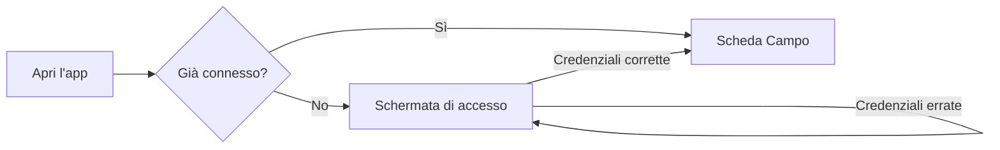
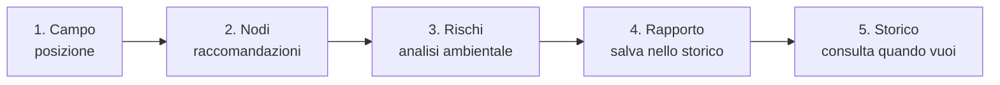
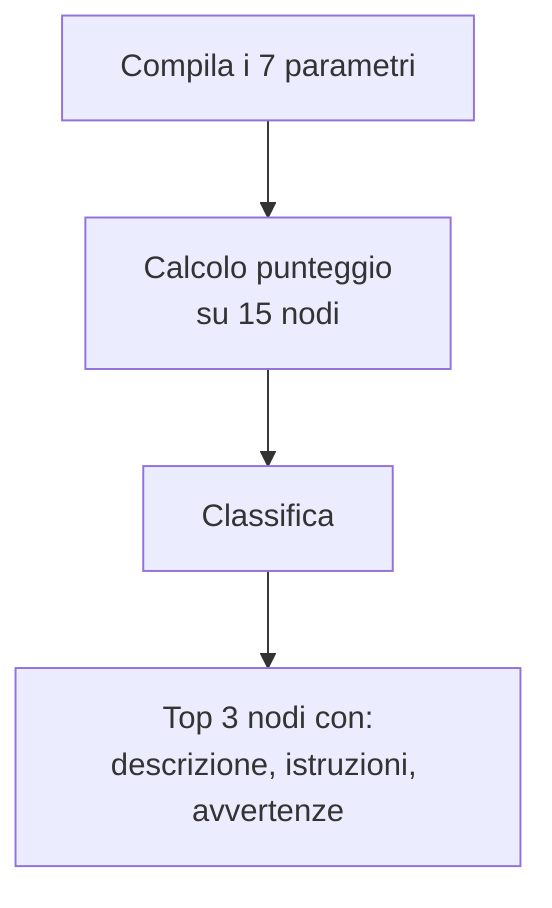
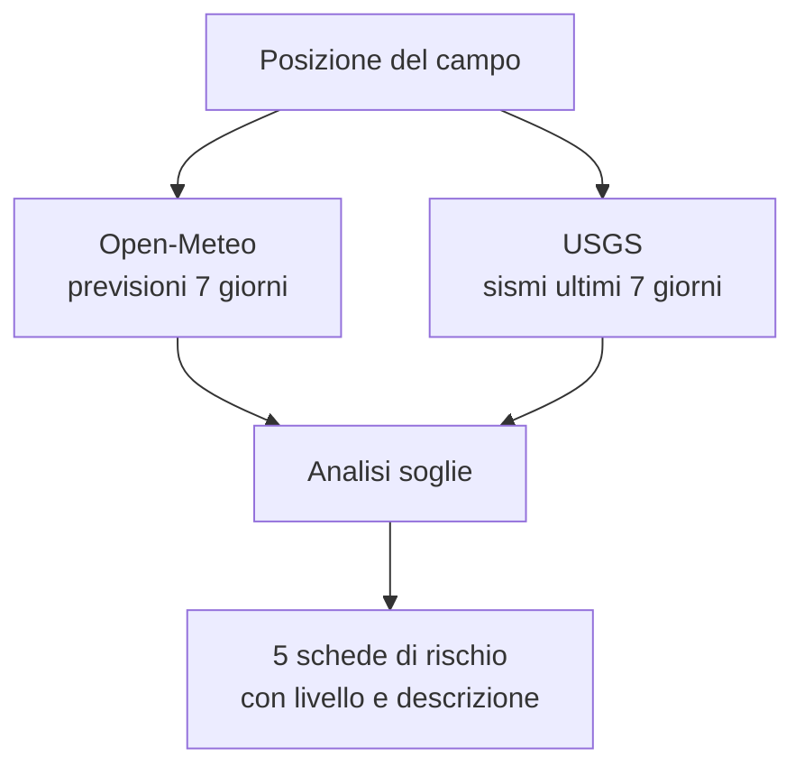

# ScoutSafe — Manuale Utente

**La sicurezza del tuo campo scout, in una sola app.**

ScoutSafe ti accompagna in tutte le fasi dell'allestimento di un campo: dalla scelta del luogo, alla selezione dei nodi giusti, fino alla valutazione dei rischi ambientali basata su dati meteo e sismici reali. Al termine puoi generare un rapporto di sicurezza completo e conservarlo nello storico.

L'app funziona da browser, su computer, tablet e smartphone, all'indirizzo:

**https://marctie.github.io/ScoutSafe/**

---

## Indice

1. [Primi passi: l'accesso](#1-primi-passi-laccesso)
2. [La struttura dell'app](#2-la-struttura-dellapp)
3. [Scheda "Campo": configurare il campo](#3-scheda-campo-configurare-il-campo)
4. [Scheda "Nodi": il consigliere di nodi](#4-scheda-nodi-il-consigliere-di-nodi)
5. [Scheda "Rischi": la valutazione ambientale](#5-scheda-rischi-la-valutazione-ambientale)
6. [Scheda "Rapporto": il rapporto di sicurezza](#6-scheda-rapporto-il-rapporto-di-sicurezza)
7. [Scheda "Storico": le sessioni salvate](#7-scheda-storico-le-sessioni-salvate)
8. [Scheda "Profilo": l'area personale](#8-scheda-profilo-larea-personale)
9. [Affidabilità delle funzioni](#9-affidabilità-delle-funzioni)
10. [Domande frequenti](#10-domande-frequenti)
11. [Avvertenze importanti](#11-avvertenze-importanti)

---

## 1. Primi passi: l'accesso

All'apertura dell'app compare la schermata di accesso. Inserisci l'email e la password che ti sono state fornite e premi **Accedi**.

- L'accesso viene ricordato sul dispositivo: alla prossima apertura entrerai direttamente, senza reinserire le credenziali.
- Per uscire, usa il pulsante **Esci** nella scheda **Profilo**.

Se compare "Password errata", controlla maiuscole/minuscole e caratteri speciali: la password li distingue.

---

## 2. La struttura dell'app

In basso trovi sei schede, pensate per essere usate in sequenza durante l'allestimento del campo:

| Scheda | Icona | A cosa serve |
|---|---|---|
| **Campo** | 🗺️ | Dai un nome al campo e fissane la posizione (GPS o manuale) |
| **Nodi** | 🪢 | Ricevi i 3 nodi più adatti alla tua situazione |
| **Rischi** | ⚠️ | Valutazione dei rischi ambientali sulla posizione del campo |
| **Rapporto** | 📄 | Riepilogo completo, con note, da salvare o stampare |
| **Storico** | 🕒 | Tutte le sessioni salvate in passato |
| **Profilo** | 👤 | Area personale: statistiche, gestione dati, uscita |

Il flusso di lavoro tipico:

---

## 3. Scheda "Campo": configurare il campo

È il punto di partenza di ogni sessione.

**Cosa fare, in ordine:**

1. **Nome del campo** — scrivi un nome riconoscibile (es. "Campo estivo Val Codera 2026").
2. **Posizione** — hai due possibilità:
   - **Usa GPS**: premi il pulsante e concedi al browser il permesso di geolocalizzazione. Le coordinate vengono rilevate automaticamente.
   - **Inserimento manuale**: digita latitudine e longitudine (le trovi ad esempio in Google Maps con un clic destro sul punto).
3. **Verifica sulla mappa** — la mappa (OpenStreetMap) mostra un segnaposto sulla posizione scelta: controlla che sia davvero il punto del tuo campo.

> 💡 **Consiglio**: se sei già sul posto, il GPS è la via più rapida e precisa. Se stai pianificando da casa, usa l'inserimento manuale con le coordinate del luogo previsto.

La posizione impostata qui viene usata dalla scheda **Rischi** per interrogare i servizi meteo e sismici: senza posizione, l'analisi dei rischi non può partire.

---

## 4. Scheda "Nodi": il consigliere di nodi

Rispondi a poche domande e ricevi i **3 nodi più adatti** alla tua situazione, ordinati per punteggio di idoneità, con descrizione, istruzioni passo-passo e avvertenze.

**I parametri richiesti:**

| Parametro | Opzioni | Perché conta |
|---|---|---|
| Scopo d'uso | ancoraggio, giunzione, asola, avvolgimento, legatura, arrampicata | Ogni nodo nasce per un compito preciso |
| Condizione corda | asciutta, bagnata | Alcuni nodi scivolano o si bloccano da bagnati |
| Tipo di corda | naturale, sintetica, mista | La tenuta cambia con il materiale |
| Tipo di carico | statico, dinamico, pesante | Un nodo per carichi statici può cedere sotto strappi |
| Esperienza | principiante, intermedio, esperto | Nodi complessi mal eseguiti sono pericolosi |
| Impiego | tenda, alzabandiera, ponte, attrezzi, soccorso, generico | Contestualizza la raccomandazione |
| Vento | assente, leggero, medio, forte | Col vento forte servono nodi che non si allentano |

**Come funziona:** l'app confronta le tue risposte con una banca dati di **15 nodi scout classici** (Gassa d'Amante, Nodo Piano, Barcaiolo, Savoia, Prussik, Scotta e altri), ciascuno descritto con i suoi punti di forza e i suoi limiti. Un algoritmo a punteggio premia i nodi adatti al tuo scenario e penalizza quelli controindicati (ad esempio il Nodo Piano su corda bagnata). Il risultato è sempre coerente e ripetibile: a parità di risposte, stessi consigli.

> ⚠️ Leggi sempre le **avvertenze** riportate sotto ogni nodo: segnalano i casi in cui quel nodo NON va usato.

---

## 5. Scheda "Rischi": la valutazione ambientale

Il cuore di ScoutSafe: un'analisi dei rischi del luogo del campo basata su **dati reali e aggiornati**, non su stime generiche.

**Prerequisito:** aver impostato la posizione nella scheda **Campo**.

**Le cinque valutazioni:**

| Rischio | Fonte dati | Soglie |
|---|---|---|
| 🌊 **Alluvione** | Previsioni di precipitazione a 7 giorni (Open-Meteo) | Basso < 5 mm/giorno · Medio 5–20 · Alto > 20 |
| 💨 **Vento** | Raffiche massime previste a 7 giorni (Open-Meteo) | Basso < 30 km/h · Medio 30–60 · Alto > 60 |
| 🌡️ **Temperatura** | Previsioni orarie (Open-Meteo) | Sicuro > 10 °C · Attenzione 0–10 · Pericolo < 0 |
| ❄️ **Neve/Ghiaccio** | Nevicate previste (Open-Meteo) | Sicuro 0 mm · Attenzione 1–10 · Pericolo > 10 |
| 🌍 **Sismico** | Terremoti reali degli ultimi 7 giorni entro 100 km (USGS) | Da "nessuno" ad "alto" in base a numero e magnitudo |

Ogni rischio è mostrato come una scheda colorata con il livello (**nessuno / basso / medio / ALTO**), il valore misurato e una descrizione di cosa significa in pratica per il campo.

> 💡 **Consiglio**: rilancia l'analisi ogni giorno durante il campo. Le previsioni meteo cambiano, e l'analisi fotografa la situazione al momento in cui la esegui.

---

## 6. Scheda "Rapporto": il rapporto di sicurezza

Raccoglie in un unico documento tutto il lavoro fatto:

- i dati del campo (nome, coordinate);
- i nodi consigliati con i parametri usati per ottenerli;
- la valutazione completa dei cinque rischi;
- le tue **note libere** (es. "torrente a 200 m, prevedere piano di evacuazione").

**Per salvare:** aggiungi le eventuali note e premi **Salva**. La sessione finisce nello **Storico** e nelle statistiche del **Profilo**.

Il rapporto è pensato anche per essere mostrato o stampato (dalla funzione di stampa del browser) come documento di riferimento per i capi campo.

> Il pulsante Salva è attivo solo se hai almeno configurato il campo e ottenuto nodi o rischi: un rapporto vuoto non è salvabile.

---

## 7. Scheda "Storico": le sessioni salvate

Qui trovi tutte le sessioni salvate, ordinate dalla più recente.

- **Tocca una sessione** per espanderla e rivedere tutti i dettagli (campo, nodi, rischi, note).
- **Elimina** una sessione con il pulsante dedicato (ti viene chiesta conferma).

**Dove sono i dati?** Le sessioni sono salvate **sul dispositivo che stai usando** (nella memoria del browser). Questo significa:

- funzionano anche senza connessione, una volta caricata l'app;
- non sono visibili da altri dispositivi: lo storico del telefono e quello del computer sono separati;
- se cancelli i dati di navigazione del browser, lo storico viene perso.

---

## 8. Scheda "Profilo": l'area personale

La tua area personale raccoglie account, statistiche e gestione dei dati.

**Cosa contiene:**

- **Il mio account** — l'email con cui sei connesso.
- **Le mie statistiche** —
  - numero totale di sessioni salvate;
  - numero di campi in cui è stato rilevato almeno un rischio **alto**;
  - data e nome dell'ultima sessione salvata.
- **Gestione dati** — il pulsante **Svuota storico** elimina in un colpo solo tutte le sessioni salvate su questo dispositivo (con richiesta di conferma; l'operazione non è reversibile).
- **Informazioni** — versione dell'app e collegamento al progetto.
- **Esci** — chiude la sessione e torna alla schermata di accesso.

---

## 9. Affidabilità delle funzioni

Percentuali di affidabilità stimate per ogni funzione, con la motivazione. Le stime tengono conto della natura dei dati (deterministici o previsionali) e della qualità delle fonti.

| Funzione | Affidabilità stimata | Motivazione |
|---|---|---|
| **Accesso e sessione** | ~99% | Meccanismo semplice e deterministico; l'unico punto di attenzione è la digitazione corretta delle credenziali |
| **Consigliere di nodi** | ~95% | Algoritmo deterministico su una banca dati curata di 15 nodi: a parità di input dà sempre lo stesso risultato. Il margine residuo riflette situazioni sul campo non catturabili da 7 parametri |
| **Rilevazione GPS** | ~90% | Dipende dal dispositivo e dall'ambiente: all'aperto la precisione è di pochi metri, al chiuso o in valli strette può degradare |
| **Mappa** | ~98% | Visualizzazione OpenStreetMap consolidata; richiede connessione per caricare le tessere della mappa |
| **Rischio sismico** | ~90% | Basato su terremoti **realmente avvenuti** (catalogo USGS, riferimento mondiale). Il limite: la sismicità passata non predice con certezza quella futura |
| **Rischio vento** | ~80–85% | Previsioni Open-Meteo a 7 giorni: molto buone nei primi 2–3 giorni (~90%), meno affidabili verso il settimo (~70%) |
| **Rischio alluvione** | ~75–80% | Basato sulle precipitazioni previste: buona approssimazione, ma il rischio reale dipende anche da fattori locali (pendenza, drenaggio, vicinanza a corsi d'acqua) che l'app non vede |
| **Rischio temperatura** | ~85–90% | Le previsioni di temperatura sono tra le più accurate; possibile scarto nei microclimi di montagna |
| **Rischio neve** | ~80% | Come per la pioggia: buone previsioni generali, variabilità locale in quota |
| **Salvataggio storico** | ~95% | Salvataggio locale immediato e affidabile; il rischio residuo è la cancellazione dei dati del browser |
| **Rapporto** | ~98% | Pura aggregazione di dati già validati nelle altre schede |

**Come leggere queste percentuali:** i valori vicini al 100% indicano funzioni deterministiche, che falliscono solo per cause esterne (connessione, permessi). I valori tra 75% e 90% riguardano funzioni **previsionali**: sono lo strumento giusto per decidere, ma vanno integrati con l'osservazione diretta e il buon senso.

---

## 10. Domande frequenti

**Posso usare l'app senza connessione?**
In parte. Una volta caricata, la navigazione tra le schede, i nodi e lo storico funzionano offline. L'analisi dei rischi e il caricamento della mappa richiedono connessione.

**Perché lo storico è vuoto su un altro dispositivo?**
I dati sono salvati localmente su ciascun dispositivo, non su un server. Ogni dispositivo ha il proprio storico.

**Le previsioni sono aggiornate?**
Sì: ogni volta che apri la scheda Rischi, l'app interroga i servizi in tempo reale. La data/ora dell'analisi è indicata nella schermata.

**Il GPS non funziona.**
Controlla di aver concesso il permesso di geolocalizzazione al browser (icona del lucchetto nella barra degli indirizzi → Autorizzazioni). In alternativa inserisci le coordinate a mano.

**Posso stampare il rapporto?**
Sì, dalla scheda Rapporto usa la stampa del browser (`Ctrl+P` su computer, menu Condividi → Stampa su smartphone).

**Ho dimenticato la password.**
Le credenziali sono gestite dall'amministratore del progetto: contattalo per il recupero.

---

## 11. Avvertenze importanti

> ⚠️ **ScoutSafe è uno strumento di supporto alle decisioni, non le sostituisce.**
>
> - Le valutazioni di rischio si basano su previsioni e dati storici: verifica sempre le condizioni reali sul posto e i bollettini ufficiali (Protezione Civile, ARPA regionali).
> - I nodi consigliati vanno eseguiti correttamente: in caso di dubbio, fatti seguire da un capo esperto. Un nodo giusto ma mal eseguito è un nodo sbagliato.
> - Per attività critiche (ponti, teleferiche, soccorso) la supervisione di personale qualificato è sempre necessaria.
> - La responsabilità finale della sicurezza del campo resta di chi lo conduce.

Buon campo! ⛺
